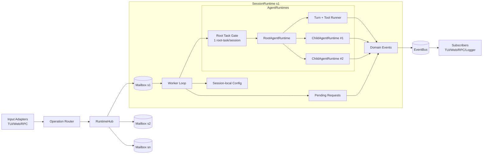
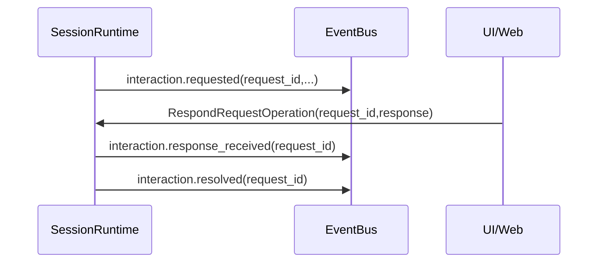

# Klaude 新运行时架构设计（面向 WebUI）

本文是新的运行时架构详细设计，目标是将当前以 TUI 为中心的单执行链路，演进为可支撑 WebUI 的多 Session 并发运行模型。

本文只覆盖**运行与输入输出编排层**，不讨论 Agent 推理策略或底层模型协议。

> 设计前提：这是个人项目，本次重构**不需要任何兼容性约束**，按“新项目理想架构”进行设计与实现。

---

## 1. 设计目标

### 1.1 业务目标

- 支持多个 session 同时运行。
- 支持 session 切换、并发、独立中断。
- 支持 interaction 请求在多 session 场景下正确路由与回填。
- 让 TUI/Web/RPC 共用同一套编排核心。

### 1.2 架构目标

- 单一入站协议：`Operation`
- 单一出站协议：`EventEnvelope`
- 会话运行边界清晰：`SessionRuntime`
- 运行时并发语义明确：`1 root-task / session` + `N child-agent-runs / root-task`

---

## 2. 非目标

- 不做对外兼容层（允许非兼容重构；默认按新项目理想架构推进）。
- 不引入多进程 worker（本阶段保持单进程 asyncio）。
- 不引入 raw/merged 双事件流（保持单事件流）。

---

## 3. 高层架构



---

## 4. 核心组件与职责

## 4.1 Operation Router

职责：

- 接受外部输入（TUI/Web/RPC）。
- 规范化为 `Operation`。
- 补齐 `operation_id` 与 `session_id`。
- 转交 RuntimeHub。

不负责：

- 会话状态管理。
- 任务生命周期管理。
- interaction pending 管理。

## 4.2 RuntimeHub

职责：

- 管理 `session_id -> SessionRuntime` 映射。
- 按 session 将 Operation 投递到对应 mailbox。
- 懒创建 SessionRuntime（首次访问时创建）。

不负责：

- 具体业务执行。
- Event 细节生成。

## 4.3 SessionRuntime

职责：

- 会话内唯一可变状态边界。
- 维护会话 mailbox 与 worker loop。
- 维护 root/child agent runtime 生命周期。
- 维护 pending requests（interaction）。
- 维护 session-local config（model/thinking 等）。

关键字段建议：

```python
class SessionRuntime:
    session_id: str
    mailbox: asyncio.Queue[Operation]

    root_agent_runtime: AgentRuntime
    child_agent_runtimes: dict[str, AgentRuntime]   # key=subtask_id

    active_root_task: TaskRun | None
    pending_requests: dict[str, PendingRequest]
    config: SessionRuntimeConfig

    event_seq: int
```

## 4.4 EventBus

职责：

- 发布 `EventEnvelope`。
- 支持按 session 或全局订阅。
- 隔离慢订阅者（不阻塞 runtime 主链路）。

建议接口：

```python
publish(event: EventEnvelope) -> Awaitable[None]
subscribe(session_id: str | None) -> AsyncIterator[EventEnvelope]
unsubscribe(...) -> None
```

---

## 5. 并发模型

## 5.1 总体并发

- 单进程，单 asyncio event loop。
- 多个 SessionRuntime 并发（跨 session 并发）。
- 每个 SessionRuntime 内部 worker loop 串行处理操作。

## 5.2 会话内并发

- **最多一个 root-task**（Prompt/Bash/Compact 对应的根执行）。
- root-task 内允许多个 child-agent-runs 并发（由工具并发策略触发）。

即：

`1 root-task / session` + `N child-agent-runs / root-task`

## 5.3 Task Gate

`Root Task Gate` 仅用于 root-task 准入，不限制 child-agent-runs。

作用：

- 防止同 session 同时启动多个 root-task 导致 history 竞争写入。
- 明确 busy/reject 行为。

---

## 6. Operation 设计

## 6.1 Operation 统一模型

```python
class Operation(BaseModel):
    operation_id: str
    session_id: str
    type: str
    payload: dict[str, Any]
```

建议操作族：

- `PromptOperation`
- `SteerOperation`
- `InterruptOperation`
- `RespondRequestOperation`
- `ChangeModelOperation`
- `ChangeThinkingOperation`
- `CompactSessionOperation`
- `RunBashOperation`

## 6.2 Operation 优先级

建议双队列：

- control queue：`interrupt`, `respond_request`
- normal queue：其余

worker loop 每次优先消费 control queue。

---

## 7. Event 设计

## 7.1 EventEnvelope

```python
class EventEnvelope(BaseModel):
    event_id: str
    session_id: str
    event_seq: int
    operation_id: str | None
    task_id: str | None
    event_type: str
    timestamp: float
    payload: dict[str, Any]
    causation_id: str | None = None
```

## 7.2 事件命名分层

- `session.*`
- `operation.*`
- `task.*`
- `stream.*`
- `tool.*`
- `interaction.*`
- `runtime.error`

## 7.3 Interaction 事件闭环



异常路径：

- session shutdown / interrupt 时：`interaction.cancelled`

---

## 8. ID 体系与语义

## 8.1 必选 ID

- `session_id`：分区键
- `operation_id`：外部输入动作 ID
- `task_id`：root 或 child 执行实例 ID
- `request_id`：pending request ID
- `event_id`：事件唯一 ID
- `event_seq`：session 内顺序号

## 8.2 关键约束

- `operation_id` 与 `task_id` 语义必须分离。
- `event_seq` 只保证同 session 单调，不保证跨 session 全序。

---

## 9. 中断与取消语义

## 9.1 InterruptOperation(session_id)

行为：

1. 标记目标 session 进入中断流程。
2. 取消 active root-task。
3. 级联取消该 root-task 关联的所有 child tasks。
4. 取消或结束 pending requests（发 `interaction.cancelled`）。
5. 发布 `task.finished(status=cancelled)`。

## 9.2 取消顺序要求

- 先 child 后 root，避免 child 在 root 结束后继续发悬空事件。

---

## 10. 持久化边界

## 10.1 durable（会写入 session history）

- 对话消息（用户、助手）
- 工具结果
- rewind / compaction 关键记录
- 必要元数据

## 10.2 ephemeral（仅 EventBus）

- 流式增量（`stream.chunk`）
- 操作接收/调度中间态
- UI 辅助提示

原则：

- replay 以 durable 数据为准。
- EventBus 不是持久化真源。

---

## 11. 运行时主循环（伪代码）

```python
async def session_worker_loop(rt: SessionRuntime) -> None:
    emit("session.started")
    while not rt.stopped:
        op = await rt.next_operation(control_first=True)
        try:
            emit("operation.accepted", op)
            match op.type:
                case "interrupt":
                    await rt.interrupt_current_root()
                case "respond_request":
                    await rt.resolve_pending_request(op)
                case "prompt" | "run_bash" | "compact":
                    await rt.start_root_task(op)  # gate check inside
                case _:
                    await rt.apply_non_task_operation(op)
            emit("operation.finished", op)
        except Exception as e:
            emit("runtime.error", {"operation_id": op.operation_id, "message": str(e)})
    emit("session.stopped")
```

---

## 12. 与当前代码的映射（迁移锚点）

| 当前 | 目标 |
|---|---|
| `Executor.submit + submission_queue` | `RuntimeHub.submit + SessionRuntime.mailbox` |
| `AgentRuntime._agent`（单实例） | `SessionRuntime.root_agent_runtime + child_agent_runtimes` |
| `TaskManager(submission_id -> task)` | `SessionRuntime.active_root_task (+ child tasks)` |
| `UserInteractionManager`（全局单 pending） | `SessionRuntime.pending_requests`（会话内） |
| `event_queue` | `EventBus`（TUI 通过 adapter 订阅） |

---

## 13. 架构不变量（Implementation Invariants）

1. 所有入站请求都必须是 Operation。
2. 所有出站消息都必须是 EventEnvelope。
3. `session_id` 是编排层一等分区键。
4. 每个 session 同时最多 1 个 root-task。
5. root-task 可并发 child-agent-runs。
6. 可变会话状态仅允许在 SessionRuntime 内修改。
7. Interrupt 必须可抢占且可级联终止。
8. interaction 必须走 request-event-operation 闭环，不允许侧通道。

---

## 14. 后续落地建议（简）

- 先落地 EventBus（保持现有 TUI adapter）。
- 再落地 RuntimeHub + SessionRuntime（先复用现有执行器）。
- 再并轨 interaction（移除独立 pending manager）。
- 最后清理旧 submission loop 结构。

本设计文档作为后续代码改造的总锚点。
