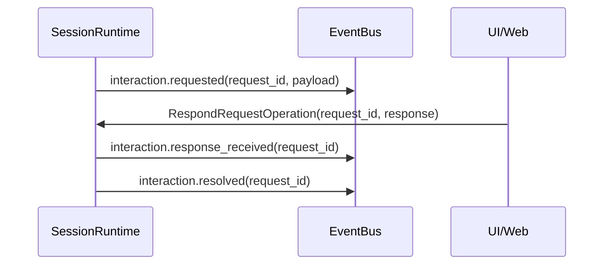
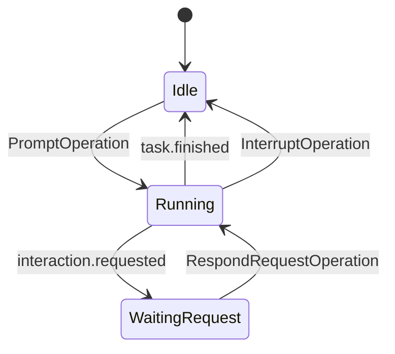

# Klaude 运行编排层数据模型（Operation/Event）

## 1. 范围说明

本文只讨论**运行与 UI 输入输出编排层**的数据模型：

- 输入：Operation 路由/排队/执行
- 输出：Event 发布/订阅
- 交互：pending request 与响应回填

不讨论 Agent/LLM 内部推理或模型协议细节。

---

## 2. 当前模型的主要问题

当前存在的 ID 与实体语义混用：

- `Operation.id` 与 `Submission.id` 实际承担同一角色。
- `submission_id` 同时被拿来做任务跟踪键（语义越界）。
- `request_id`（interaction）独立于主输入链路，形成侧通道。
- Event 缺少稳定序号/事件主键，不利于多订阅者一致消费。

---

## 3. 目标实体（编排层）

建议收敛到 5 个核心实体：

1. `RuntimeHub`：全局 Operation 入口与 session 路由。
2. `SessionRuntime`：单 session 运行边界（mailbox + active task + pending requests）。
3. `Operation`：统一入站动作。
4. `PendingRequest`：等待用户或外部响应的请求状态。
5. `EventEnvelope`：统一出站事件封装。

---

## 4. ID 体系（建议）

## 4.1 必选 ID

- `session_id`
  - 会话分区键，所有 Operation/Event/Request 必带。

- `operation_id`
  - 一次输入动作的唯一标识（替代当前 `submission_id` 语义）。

- `task_id`
  - 一次 long-running 执行实例（agent/bash/compact）。
  - 与 `operation_id` 分离，避免“输入 ID 兼任运行实例 ID”。

- `request_id`
  - pending request（interaction 等）的唯一标识。

- `event_seq`
  - 建议按 session 单调递增（`session_id + event_seq` 可唯一定位事件）。

## 4.2 可选关联 ID

- `causation_id`
  - 表示事件由哪个 operation/request 导致。

- `correlation_id`
  - 跨多次 operation 的业务链路追踪（可后置）。

---

## 5. Operation 模型（入站）

```python
class Operation(BaseModel):
    operation_id: str
    session_id: str
    type: Literal[
        "prompt",
        "steer",
        "interrupt",
        "respond_request",
        "change_model",
        "change_thinking",
        "compact_session",
    ]
    payload: dict[str, Any]
```

说明：

- UI/TUI/Web/RPC 的输入都统一转换为 Operation。
- `RuntimeHub` 只负责按 `session_id` 路由到 `SessionRuntime.mailbox`。

---

## 6. SessionRuntime 模型（会话内）

```python
class SessionRuntime:
    session_id: str
    mailbox: asyncio.Queue[Operation]

    # 会话运行状态
    root_agent_runtime: AgentRuntime
    child_agent_runtimes: dict[str, AgentRuntime]  # key=subtask_id
    active_root_task: TaskRun | None
    pending_requests: dict[str, PendingRequest]

    # 会话局部配置（必须与其他 session 隔离）
    config: SessionRuntimeConfig
```

`SessionRuntimeConfig` 最小字段建议：

- `model_name`
- `model_config_name`
- `thinking`
- `sub_agent_models`（可选）
- `compact_model`（可选）

---

## 7. TaskRun 模型（执行实例）

```python
class TaskRun(BaseModel):
    task_id: str
    session_id: str
    operation_id: str
    kind: Literal["agent", "bash", "compact"]
    status: Literal["running", "done", "cancelled", "failed"]
```

约束：

- 每个 `SessionRuntime` 同时最多一个 running root `TaskRun`。
- root `TaskRun` 内可派生多个 child runs（sub-agent 并发）。
- `interrupt` 仅影响目标 session 的 `active_root_task`，并级联取消 child runs。

---

## 8. PendingRequest 模型（交互请求）

```python
class PendingRequest(BaseModel):
    request_id: str
    session_id: str
    source: Literal["tool", "approval", "system"]
    payload: dict[str, Any]
    status: Literal["pending", "resolved", "cancelled", "expired"]
```

说明：

- Interaction 不再是独立通道，而是 SessionRuntime 内部状态。
- 响应通过 `RespondRequestOperation` 回填。
- 同一 session 仅 1 个 root task；但 root task 下可有多个 child agent runtime 并发。

---

## 9. EventEnvelope 模型（出站）

```python
class EventEnvelope(BaseModel):
    event_id: str
    session_id: str
    event_seq: int
    operation_id: str | None
    task_id: str | None
    event_type: str
    timestamp: float
    payload: dict[str, Any]
    causation_id: str | None = None
```

说明：

- EventBus 对外发布的统一形态。
- UI 层不直接依赖内部对象实例，全部走 envelope。

---

## 10. Event 模型重整（基于当前 `protocol/events.py`）

### 10.1 当前问题

当前 `src/klaude_code/protocol/events.py` 同时包含三类语义：

1. 领域事件：如 `TaskStartEvent`、`ToolResultEvent`
2. 渲染事件：如 `AssistantTextStart/Delta/End`、`ThinkingStart/Delta/End`
3. UI 辅助事件：如 `WelcomeEvent`、`CommandOutputEvent`

这会导致：

- 事件边界不清（哪些可持久化，哪些只是渲染细节）
- 跨端消费困难（Web/TUI 对 UI 辅助事件依赖差异大）
- Interaction 生命周期不完整（仅有 request，缺 response/resolved/cancelled）

### 10.2 统一事件类型命名建议

建议将 `event_type` 规范为分层前缀：

- `session.*`
- `operation.*`
- `task.*`
- `stream.*`
- `tool.*`
- `interaction.*`
- `runtime.error`

### 10.3 最小事件集（建议）

#### Session
- `session.started`
- `session.updated`
- `session.stopped`

#### Operation
- `operation.accepted`
- `operation.rejected`
- `operation.finished`

#### Task
- `task.started`
- `task.finished`
- `task.progress`（可选）

#### Stream（保留流式渲染能力）
- `stream.chunk`
  - 字段建议：`channel`(`assistant|thinking`), `delta`, `done`, `response_id`

#### Tool
- `tool.call`
- `tool.result`

#### Interaction
- `interaction.requested`
- `interaction.response_received`
- `interaction.resolved`
- `interaction.cancelled`
- `interaction.expired`（可选）

#### Error
- `runtime.error`

### 10.4 Interaction 事件闭环（建议）



若会话被中断/关闭：

- `interaction.cancelled(request_id, reason)`

### 10.5 当前事件到新事件映射（简表）

| 当前事件 | 新事件 |
|---|---|
| `TaskStartEvent` | `task.started` |
| `TaskFinishEvent` | `task.finished` |
| `ToolCallEvent` | `tool.call` |
| `ToolResultEvent` | `tool.result` |
| `Thinking*` + `AssistantText*` | `stream.chunk` |
| `UserInteractionRequestEvent` | `interaction.requested` |
| `ErrorEvent` | `runtime.error` |
| `WelcomeEvent` / `CommandOutputEvent` | `session.updated` / `operation.finished` 内部信息 |

---

## 11. ID 对照迁移（当前 -> 目标）

| 当前字段 | 当前语义 | 目标字段 | 目标语义 |
|---|---|---|---|
| `Operation.id` | 输入请求 ID | `operation_id` | 输入请求 ID |
| `Submission.id` | 同上（重复） | 删除 | 概念合并 |
| `submission_id`（TaskManager key） | 任务跟踪 key | `task_id` | 运行实例 ID |
| `request_id` | interaction 请求 ID | `request_id` | 保持不变（并入 SessionRuntime） |
| 无统一事件主键 | 仅依赖时间/顺序 | `event_id` | 事件唯一标识 |
| 无统一事件序号 | 依赖到达顺序 | `event_seq` | 稳定订阅序 |

---

## 12. 最小状态流转



---

## 13. 关键约束（必须满足）

1. `session_id` 是所有编排消息的第一分区键。
2. `operation_id` 与 `task_id` 必须分离。
3. pending request 必须会话内管理，禁止全局单槽。
4. Event 必须有稳定序（至少 session 内 `event_seq`）。
5. SessionRuntime 配置必须局部化，禁止可变全局共享运行态。
