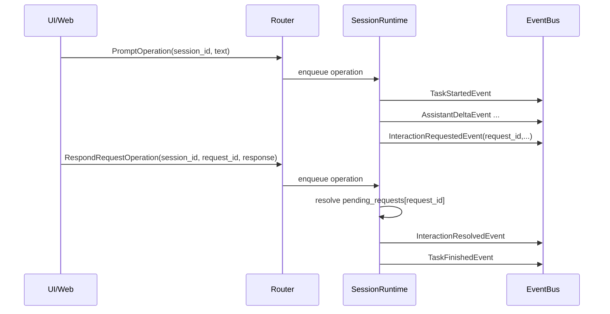

# Klaude Runtime 重构蓝图（面向 WebUI 多 Session）

## 1. 背景

当前 klaude 的运行时主要围绕 TUI 单会话交互构建。随着目标变为支持 WebUI（多 session 管理、并发运行、切换 session），现有架构出现了明显的结构性限制：

- 输入通道分裂：`submit operation`、`interaction` 为两套机制。
- 输出通道单一：`event_queue` 同时承担领域事件与 UI 驱动事件。
- 会话状态污染风险：全局 `llm_clients` + `AgentRuntime` 单 `_agent`，不利于多 session 并发隔离。

本蓝图定义目标架构，不讨论迁移阶段细节。

---

## 2. 目标（简版）

目标是建立一个**会话级运行时模型**：

1. 输入侧：每个 session 有自己的 Operation 队列（MQ / mailbox）。
2. 输出侧：统一 EventBus，供外部订阅。
3. Interaction 不再是侧通道，改为统一 Operation/Event 闭环。
4. 会话状态封装到 `SessionRuntime`，彻底避免跨 session 状态污染。

并且默认前提是：

- 这是个人项目，可进行**非兼容重构**。
- 不引入“raw/merged 双流”分层；保留单一事件流即可（已具备流式渲染能力）。

---

## 3. 理想架构总览

```mermaid
flowchart LR
    IN[Input Adapters\nTUI/Web/RPC] --> ROUTER[Operation Router]

    ROUTER --> MB1[(Session Mailbox s1)]
    ROUTER --> MB2[(Session Mailbox s2)]
    ROUTER --> MBN[(Session Mailbox sn)]

    subgraph SR1[SessionRuntime s1]
      MB1 --> W1[Worker Loop]
      W1 --> G1[Root Task Gate\n1 root-task per session]
      W1 --> P1[Pending Requests\ninteraction/tool request]
      W1 --> C1[Session-local Config\nmodel/thinking/sub-agent model]

      subgraph AR1[AgentRuntimes]
        G1 --> R1[RootAgentRuntime\n(root run)]
        R1 --> T1[Turn + Tool Runner]
        R1 --> CRun1[ChildAgentRuntime #1]
        R1 --> CRun2[ChildAgentRuntime #2]
        R1 --> CRunN[ChildAgentRuntime #N]
      end

      T1 --> E1[Domain Events]
      CRun1 --> E1
      CRun2 --> E1
      CRunN --> E1
      P1 --> E1
    end

    subgraph SR2[SessionRuntime s2]
      MB2 --> W2[Worker Loop]
      W2 --> G2[Root Task Gate]
      W2 --> P2[Pending Requests]
      W2 --> C2[Session-local Config]
      G2 --> R2[RootAgentRuntime]
      R2 --> CR2[ChildAgentRuntimes (concurrent)]
      R2 --> E2[Domain Events]
      CR2 --> E2
      P2 --> E2
    end

    E1 --> BUS[(EventBus)]
    E2 --> BUS
    BUS --> SUB[Subscribers\nTUI/Web/RPC/Logger]
```

---

## 4. 核心设计原则

### 4.1 单一输入协议：Operation

所有入站动作统一成 Operation，不再混用 operation + interaction 侧通道。

建议最小集合：

- `PromptOperation`
- `SteerOperation`
- `InterruptOperation`
- `RespondRequestOperation`
- `ChangeModelOperation`
- `ChangeThinkingOperation`
- `CompactSessionOperation`

Operation 总是带 `session_id`，由 Router 投递到对应 session mailbox。

### 4.2 单一输出协议：Event

所有出站信息统一成 Event（可流式、可订阅）。

建议事件 envelope：

- `event_id`
- `session_id`
- `event_type`
- `timestamp`
- `payload`
- `causation_id`（可选，指向触发该事件的 operation/request）

### 4.3 Interaction 并轨

Interaction 不再通过独立 manager 队列在运行时外层“旁路处理”。

标准闭环：

1. `InteractionRequestedEvent(request_id, session_id, payload)`
2. 外部提交 `RespondRequestOperation(request_id, session_id, response)`
3. runtime 内部 resolve pending request
4. `InteractionResolvedEvent`

### 4.4 会话内状态强隔离

`SessionRuntime` 必须成为唯一的会话运行时边界，持有并管理：

- `root_agent_runtime`
- `child_agent_runtimes`（当前 root task 关联的子运行时集合）
- `active_root_task`
- `child_tasks`（由 root task 派生并托管，对应 child agent runtime）
- `pending_requests`（interaction/tool callback 等）
- `session-local config`（model/thinking/sub-agent model 等）

禁止使用全局共享运行态来驱动会话行为（尤其是全局 `_agent` 或全局可变 llm config）。

---

## 5. SessionRuntime 结构（建议）

```text
SessionRuntime
  - session_id: str
  - mailbox: asyncio.Queue[Operation]
  - root_agent_runtime: AgentRuntime
  - child_agent_runtimes: dict[subtask_id, AgentRuntime]
  - active_root_task: asyncio.Task | None
  - child_tasks: dict[subtask_id, asyncio.Task]
  - pending_requests: dict[request_id, Future/RequestState]
  - config: SessionRuntimeConfig
  - publisher: EventPublisher

  methods:
    - run_loop()
    - handle_operation(op)
    - start_root_task(...)
    - interrupt(...)
    - resolve_request(...)
    - shutdown(...)
```

关键约束：

- 每个 session 同时最多一个 root task（main agent/bash/compact）。
- 单个 root task 内允许多个 child runs（sub-agent loops）并发。
- `interrupt` 对本 session 抢占优先。
- `shutdown` 时必须清空并 resolve 所有 `pending_requests`，避免悬挂。

---

## 6. EventBus 结构（建议）

EventBus 只做两件事：

1. 接收 runtime 发布事件。
2. 支持订阅者按 session（或全局）消费。

不承担业务决策，不持有 agent 状态。

最小接口：

- `publish(event)`
- `subscribe(session_id: str | None) -> AsyncIterator[Event]`
- `unsubscribe(...)`

实现要求：

- 慢订阅者不能阻塞 runtime 主执行。
- 订阅失败隔离（单个 subscriber 崩溃不影响主链路）。

---

## 7. 与当前代码的对应关系（抽象层）

### 现状

- `Executor.submit(operation)`：输入主入口
- `event_queue`：输出主入口
- `UserInteractionManager`：interaction 侧通道
- `AgentRuntime._agent`：单活跃 agent

### 目标

- `OperationRouter -> SessionRuntime.mailbox`
- `SessionRuntime -> EventBus`
- `pending_requests` 内聚到 SessionRuntime
- 移除“独立 interaction 等待循环”作为架构核心机制

---

## 8. 典型时序（Prompt + Interaction）



---

## 9. 非目标（本蓝图刻意不包含）

- 分阶段迁移计划
- 具体文件级改造步骤
- 向后兼容策略
- 协议版本兼容策略

这些在后续细化文档中处理。

---

## 10. 一句话总结

这次重构的本质是：

> 从“单 executor + 三条割裂通道”，升级为“会话级 actor + 统一 Operation/Event 协议 + EventBus 订阅模型”。

这样才能自然支撑 WebUI 的多 session 并发与切换，同时保持流式渲染能力。
