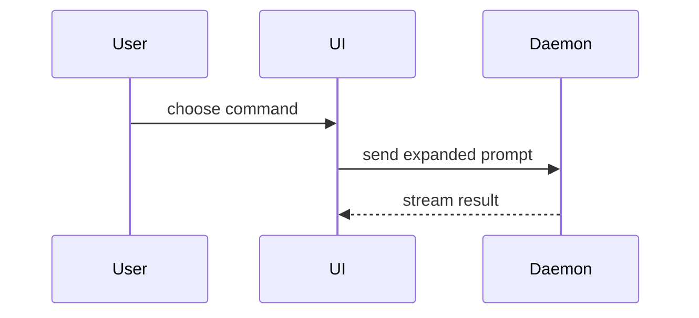

# Explaining Visually

When the user asks you to explain a system, walk through a design, or compare options, show the shape instead of describing it in prose. Skip the preamble. Pick the smallest view that makes the key point clear, and place it next to the short text it supports. Keep only the calls, files, props, states, and boundaries the current question needs. Use one of these forms, sometimes a few; you will rarely use all of them. A visual replaces prose -- it does not add to it, and it does not turn a one-line answer into a diagram.

- Logic or an algorithm: pseudocode.

```text
on(save)
  if content is unchanged
    return cached result
  write new content
  return fresh result
```

- Runtime control flow: a call tree.

```text
submitForm
  createSession
    persistPrompt
    launchAgent
  navigateToSession
```

- UI structure: a component tree, including the state and module boundaries that matter.

```tsx
<SessionPage> (apps/example/src/routes/session.tsx)
  useSessionEvents()
  <SessionToolbar>
    <RunSkillButton> (packages/ui)
```

- File responsibility or a broad refactor: a shallow file tree.

```text
src/
├── commands/       # parses user actions
├── sessions/       # owns session state
└── transport/      # sends API requests
```

- Component interaction or data flow: Mermaid.



- What changes, when the surrounding shape already exists: a `diff`. Match the diff shape to the topic -- diff the file tree for a layout change, the call tree for a flow change, the pseudocode for a state change.

```diff
 src/
 ├── commands/
+│   └── show-me.ts       # expands the slash command
 ├── sessions/
-└── transport.ts
+└── transport/
+    ├── client.ts
+    └── stream.ts
```

```diff
 on(save)
-  write content
+  if content is unchanged
+    return cached result
+  write new content
+  invalidate cache
```

- The whole block, when most of it is new, when omitted context would hide ownership or order, or when the user needs a copyable target shape.

- A layout, a state comparison, or a concept too dense for Mermaid: one focused HTML file -- a diagram, an infographic, or a short slide deck, whichever fits the point. Match the product's colors, type, spacing, and components; use real labels and data; support desktop and mobile. Then open it with `Bash`: `open path/to/show-me-{description}.html`.
