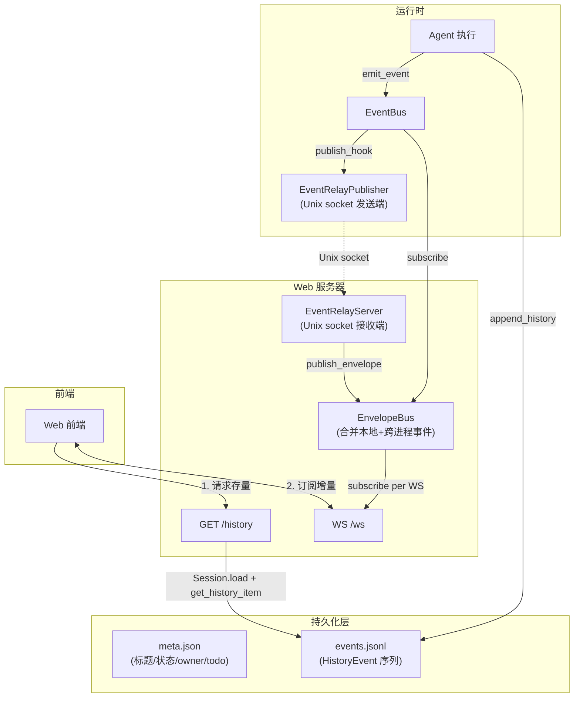
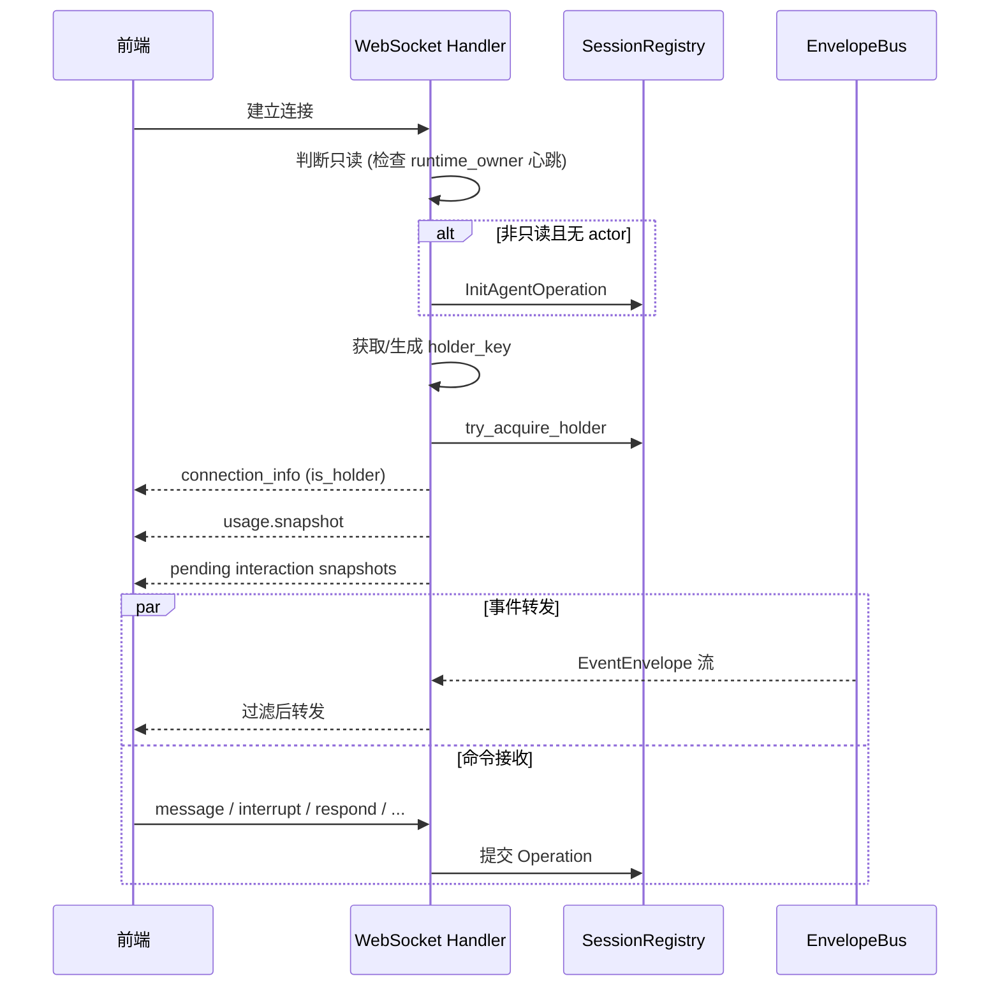
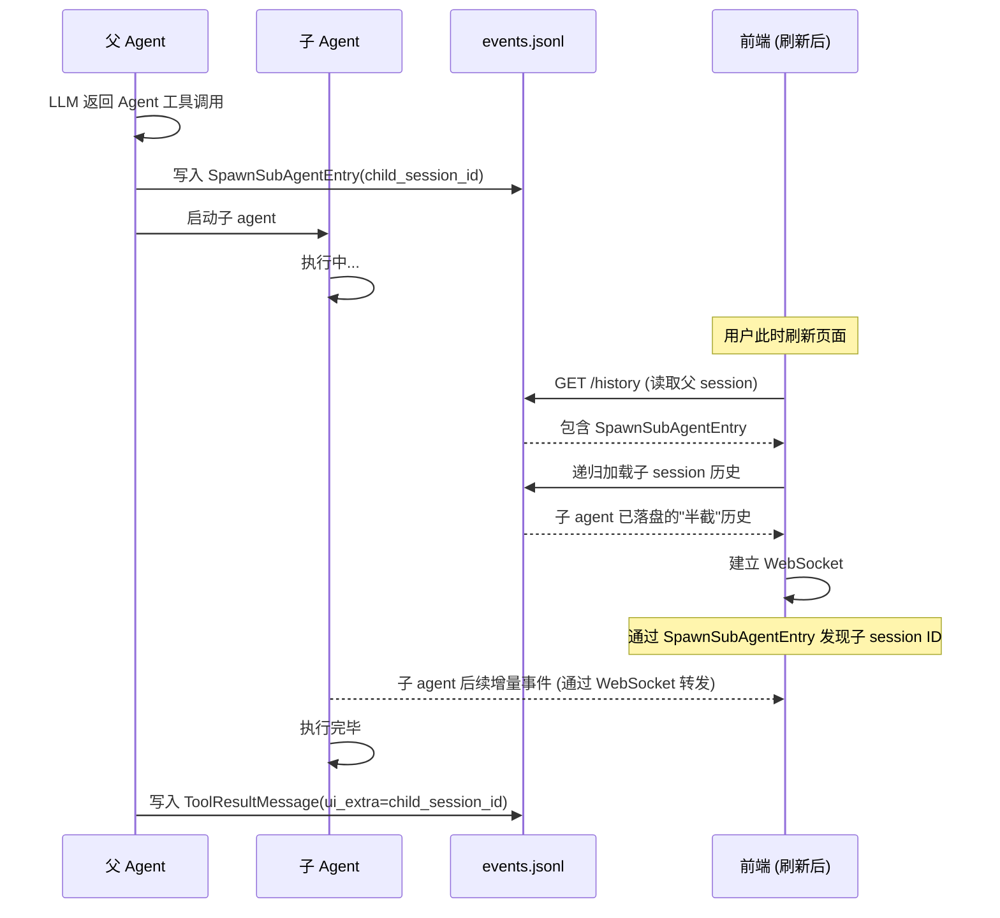

# Session 事件链路总览

本文档描述 Web 端如何加载会话历史、订阅实时事件、以及处理子 agent 续联。

## 核心概念

| 概念                 | 说明                                                                                           |
| -------------------- | ---------------------------------------------------------------------------------------------- |
| `HistoryEvent`       | 持久化到 `events.jsonl` 的完整消息（UserMessage / AssistantMessage / ToolResultMessage 等）    |
| `EventEnvelope`      | 运行时实时事件的传输包装，包含细粒度 delta（AssistantTextDelta、ThinkingDelta 等），不直接落盘 |
| `ReplayEventUnion`   | 从 `HistoryEvent` 重新编译出的回放事件，重建流式边界（Start/Delta/End）                        |
| `SpawnSubAgentEntry` | 写入父 session 历史的标记，记录子 agent 的 session_id，在子 agent 开始执行前写入               |

## 整体架构



## 打开一个会话的完整流程

### 第一步：GET /api/sessions/{session_id}/history

获取截至当前的全量历史快照。

1. `resolve_session_work_dir()` 找到会话所在项目目录
2. `Session.load()` 从磁盘读取 `meta.json` + `events.jsonl`
3. 如果内存中的 session 比磁盘更新（有尚未 flush 的 items），优先用内存版本
4. `session.get_history_item()` 将 `HistoryEvent` 列表重编译为 `ReplayEventUnion` 事件序列
5. 返回 `{"session_id": ..., "events": [...]}`

`get_history_item()` 的关键处理：

- 对每个 `AssistantMessage` 重建 ThinkingStart/Delta/End + AssistantTextStart/Delta/End 边界
- ToolCall 做延迟发射（等对应 ToolResult 出现后一起发）
- 递归展开子 agent 历史（通过 `SpawnSubAgentEntry` 和 `ToolResultMessage.ui_extra`）
- 最后发 `TaskFinishEvent`

### 第二步：WS /api/sessions/{session_id}/ws

建立实时双向连接，获取增量事件。



#### 事件过滤逻辑

WebSocket 订阅全局 `EnvelopeBus`，按以下规则过滤：

1. `envelope.session_id == 当前session` → 放行，追踪其 `task_id`
2. `envelope.session_id` 在已知子 session 集合中 → 放行，追踪其 `task_id`
3. `envelope.task_id` 在已追踪集合中 → 放行
4. 其他 → 丢弃

`tracked_task_ids` 的初始化：

- 如果有内存中的 session snapshot（同一 web server 启动的会话），直接取 `active_root_task.task_id`
- 子 agent 事件继承父 agent 的 `task_id`（通过 `event_publish_context` 传递），所以通过 task_id 机制自然转发

## 子 Agent 续联

### 问题

子 agent 的 session_id 原本只在 `ToolResultMessage.ui_extra` 中暴露，如果子 agent 正在执行中（ToolResult 还没产生），刷新页面后无法发现子 agent。

### 解决方案



**关键点：**

- `SpawnSubAgentEntry` 在子 agent 开始执行**之前**写入父 session 历史
- history 接口通过 `_iter_sub_agent_history_by_id()` 递归展开子 session
- 去重靠 `seen_sub_agent_sessions` 集合，避免 `SpawnSubAgentEntry` 和 `ToolResultMessage` 同时存在时重复展开

### 跨进程场景（TUI → Web 查看）

当 Web 端没有 session 的内存 snapshot 时（如查看 TUI 拥有的会话）：

1. `tracked_task_ids` 为空（无 snapshot）
2. WebSocket 连接时扫描父 session 的磁盘历史，通过 BFS 收集所有 `SpawnSubAgentEntry` 中的子 session ID
3. 子 session 事件通过 `session_id` 匹配放行
4. 放行时同时种入 `task_id`，使后续动态 spawn 的孙 agent 也能通过 `task_id` 机制转发

## 用户交互（Interaction）的持久化现状

AskUserQuestion 等用户交互在持久化层**没有被完整记录**，目前只存在于内存。

### 已持久化的部分

| 内容                             | 存储位置                       |
| -------------------------------- | ------------------------------ |
| `session_state=waiting_user_input` | `meta.json`（粗粒度状态标记） |
| 用户回答后的 `ToolResultMessage` | `events.jsonl`                 |

### 未持久化的部分

| 内容                                               | 仅存在于         |
| -------------------------------------------------- | ---------------- |
| 请求 payload（问题内容、选项、request_id）         | `SessionActor.pending_requests`（内存） |
| tool_call_id 与 interaction 的映射                 | `WebInteractionHandler._pending`（内存） |
| interaction 的 future（等待用户回答的异步句柄）     | 内存中的 asyncio.Future |

### 链路概览

```
LLM 返回 AskUserQuestion tool_call
  → AskUserQuestionTool.call() 组装 AskUserQuestionRequestPayload
  → runtime_agent_ops._request_user_interaction() 包装为 PendingUserInteractionRequest
  → RuntimeFacade._request_user_interaction()
    → open_pending_interaction() 注册内存 future
    → 持久化 session_state = WAITING_USER_INPUT
    → await future（阻塞等待用户回答）
  → 前端收到 UserInteractionRequestEvent，展示问题
  → 用户提交 → UserInteractionRespondOperation
  → future 被 resolve → AskUserQuestionTool 返回 ToolResultMessage
  → append_history() 落盘
```

### 恢复行为

- **WebSocket 重连（runtime 存活）**：`pending_requests_snapshot()` 会重新推送当前挂起的 interaction，前端可以恢复显示
- **进程重启 / session resume**：pending interaction 丢失。磁盘上只剩 `session_state=waiting_user_input` 标记，但没有足够信息重建问题内容和选项。中断时 `ToolExecutor.on_interrupt()` 会把未完成的 tool call 写成 `ToolResultMessage(status="aborted")`

## 只读判定

Web 端通过 `load_session_read_only()` 判断会话是否只读：

| 条件                                    | 结果         |
| --------------------------------------- | ------------ |
| 当前 web server 持有该 session 的 actor | 可写         |
| owner 心跳超过 15 秒                    | 可写（接管） |
| owner 是同一个 runtime_id               | 可写         |
| owner 是 TUI 且心跳存活                 | 只读         |
| owner 是其他 Web 且会话 running/waiting | 只读         |

只读会话：不初始化 actor、不获取 holder、前端只能查看不能发送命令。
